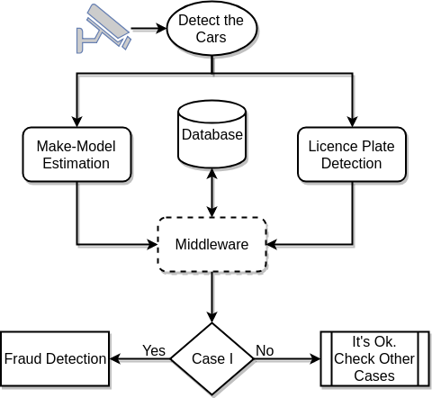

# Test Result on Some Youtube Videos

[Youtube Videos](https://www.youtube.com/watch?v=ap9glASN9xc&list=PLM7sp8Qv0OM_dZ0s4LQAtab4WbVuQsccc)

I have just uploaded some parts of my master thesis. I will be uploading the rest and arrange them soon. 

## Submitted to ICANN 2018 

We wrote a paper from the thesis work. 
It has been accepted by [The 27th International Conference on Artificial Neural Networks.](https://e-nns.org/icann2018/)

## There are Three Experiments in This Work

## Some Results from the Experiments

It will be uploaded..

You can see the results of some Youtube videos in **ResultVideos** folder.

## It is flowchart of the application

We have applied our make and model prediction method for catching up fraud on licence plate. 

