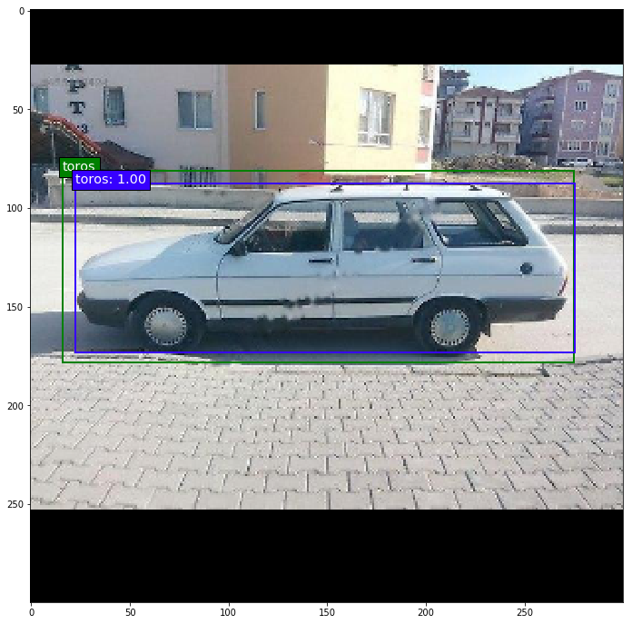
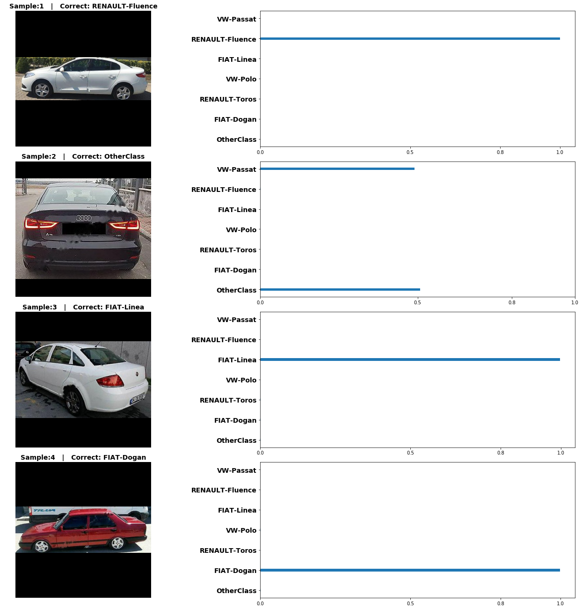
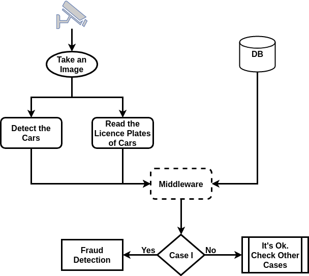

I have just uploaded some parts of my master thesis. I will be uploading the rest and arrange them soon. 

I have collected approximately 28K images of cars via online sources. It includes seven classes with different make and models.


## This is How I Define Ground Truth Labels of Images by Using a Pretrained SSD

For detection part, It is needed to have ground truth bounding boxes for every cars of images. Instead of labelling manually, I used a pre-trained SSD (on MS COCO and PASCAL VOC) to label them.

In this case, every image of a class stays under the same file. 

```pseudo
Set a value for certain size
Get into the first file
    For all images of the file:
        Read an image and pass through the pre-trained SSD to extract only cars
            If detected object is higher than certain size:
                Label it as a class related to that file
            If not:
                Ask annotator to label or delete it:
Go to next file if any
```

## There are Three Experiments in This Work


## Some Results from Experiments

It is a good one. It can predict the bounding boxes even better than the ground truth ones.


It is bad one. Especially a car is quite small, it generally confuses.


Some result from Experiment II



## It is flowchart of the application

We have applied our make and model prediction method for catching up fraud on licence plate. 


